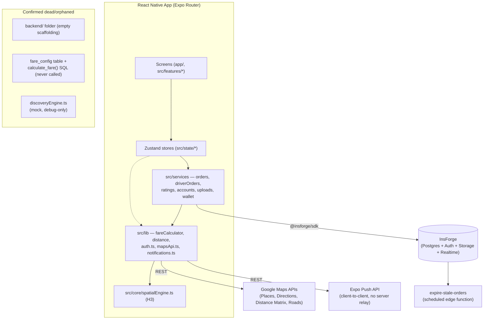

# 2Go Mobile App — Full Engineering Audit

**Date:** 2026-07-26
**Scope:** Complete codebase audit — architecture, UI/UX, performance, security, maps, dispatch, pricing, notifications, driver/passenger systems, admin, AI readiness.
**Method:** Direct file inspection + 6 parallel deep-dive research passes across the full repo. No code changes made. No assumptions carried over from the audit brief where they conflicted with what's actually in the repo.

## ⚠️ Correction to audit brief assumptions

The requested audit brief assumed **Clerk Authentication**, **Supabase Backend**, and **Firebase Cloud Messaging + Apple Push Notifications**. None of these are true of this codebase:

- **Backend/Auth is InsForge** (`@insforge/sdk`), not Supabase or Clerk. The project's own `AGENTS.md` (lines 59-64) explicitly bans Clerk/Auth0/WorkOS/Better Auth/Supabase/Neon/`pg` and instructs agents to flag any reintroduction. A stale `INSTRUCTIONS.md` (leftover Expo template doc) still references Clerk/Neon/pg — that file does not reflect the real app.
- **No Firebase Cloud Messaging or native Apple Push Notifications SDK exists.** Push is 100% Expo-managed (`expo-notifications` + Expo's hosted push relay). No `@react-native-firebase/*` package, no `google-services.json`, no `GoogleService-Info.plist`, no FCM/APNs plugin config anywhere in the repo.

This audit proceeds against the **real** stack: React Native 0.81.5 + Expo SDK ~54 + Expo Router ~6 + TypeScript, NativeWind 4, Zustand 5, `react-native-maps`/`@react-google-maps/api`, InsForge (Postgres + auth + storage + realtime + edge functions), `h3-js` spatial engine, Expo push notifications, EAS Build.

---

# PHASE 1 — PROJECT DISCOVERY

## Folder structure

```
app/                          Expo Router file-based routes
  _layout.tsx                 Root Stack — session gating, splash, push registration
  welcome.tsx, auth.tsx, signup.tsx, otp.tsx, forgot-password.tsx
  discover.tsx, account.tsx, profile.tsx, modal.tsx (dead template screen)
  (tabs)/                     Bottom tabs, role-conditional (index, activity, wallet,
                               navigate, messages, account, explore[dead])
  (customer)/                 Customer active-trip stack (trip.tsx)
  (driver)/                   Driver active-trip stack (navigation.tsx, trip.tsx, trip-summary.tsx)
  chat/[id].tsx, ride/[id].tsx, rating/[id].tsx, rating/driver.tsx
  driver/onboarding.tsx        4-step "Become a Driver" wizard

src/
  assets/images/               20 files, 18MB total (see Phase 4 — heavy/duplicated)
  components/
    map/                      Map.native.tsx / Map.web.tsx / Map.tsx / MapPlaceholder.tsx
    ui/                       Button, Card, Input, IconButton, Pill, Chip, BackButton,
                               SegmentedControl, BottomSheet, Divider, RideActionSlider, RatingStars
    system/                   ErrorBoundary
  constants/                  env.ts, theme.ts, mapStyle.ts, mockData.ts
  core/spatialEngine.ts         sole h3-js wrapper (rule honored — no other direct h3-js imports)
  features/                    account, activity, auth, discover, driver, messaging,
                               onboarding, passenger, wallet, welcome
  hooks/                       useCurrentLocation, useSnappedLocation, useAnimatedMarker,
                               useDriverTelemetryPing, useNotificationTapNavigation,
                               useRoadSnappedVehicle, useTurnPreview, use-color-scheme
  lib/                         fareCalculator.ts, distance.ts, formatAddress.ts, polyfills.ts,
                               auth.ts, notifications.ts, insforge.ts, locationSearch.ts,
                               google/mapsApi.ts, google/mapStyle.ts
  services/                    discoveryEngine.ts, driverOrders.ts, orders.ts, accounts.ts,
                               ratings.ts, messages.ts, uploads.ts, wallet.ts
  state/                       authStore, userStore, driverStore, rideStore, messagingStore,
                               driverWalletStore, settingsStore
  types/index.ts               all TS types
  screens/                    empty (.gitkeep only) — not actually used

backend/                      DEAD — every subfolder (api/db/services/types/utils) contains
                               only a .gitkeep; package.json is an empty stub; nothing in
                               src/ or app/ imports from it. Orphaned scaffolding.
functions/expire-stale-orders.ts   Only real server-side function — InsForge scheduled
                               edge function, cron-secret-protected, sweeps expired pending orders
migrations/                   21 SQL files, InsForge/Postgres — see full schema below
docs/                          H3 + Google Maps setup docs (some now stale vs code, noted below)
.insforge/project.json, insforge.toml   InsForge project config (gitignored where sensitive)
```

## Architecture map (narrative)

- **Navigation**: Expo Router file-based routing wrapping React Navigation. Root `Stack` in `app/_layout.tsx` uses `Stack.Protected` to gate three mutually-exclusive route sets: pre-first-login (`welcome`), unauthenticated (`auth`/`signup`/`otp`/`forgot-password`), and authenticated (everything else). Session hydration is a state machine (`idle→checking→ok/retry`) that re-validates the customer/driver row on every cold start and force-signs-out on deleted/suspended accounts. Tab bar visibility is role-conditional via `href: null` per tab.
- **State**: Zustand, one store per domain, mostly consumed correctly via selectors in `rideStore`/`userStore` call sites, but **`driverStore` is subscribed to as a whole object almost everywhere it's used** (see Phase 4) — this is the single biggest re-render risk in the app.
- **Backend**: InsForge only. Mobile app talks to it directly via `@insforge/sdk` (`src/lib/insforge.ts`), no intermediary server except one scheduled edge function. The `backend/` folder is unused scaffolding.
- **Database**: Postgres via InsForge, RLS-protected, with `SECURITY DEFINER` trigger functions enforcing money-moving invariants (wallet ledger, order-status transitions) — well-designed at the schema level, but the actual fare amount written to `orders.fare_amount` is client-computed and untrusted end-to-end (Phase 5/8 — the single most serious finding in this audit).
- **Maps/spatial**: `react-native-maps` (native) / `@react-google-maps/api` (web), correctly platform-split via file extension so bundlers tree-shake the unused one. All Google REST calls centralized in `mapsApi.ts`. H3 (`spatialEngine.ts`) is used for real driver-order matching (`driverStore.isPickupNearby`) but the more "advanced" `discoveryEngine.ts` nearby-driver-pool code is dead/demo-only, gated behind a debug flag.
- **Dispatch**: Broadcast-to-all-eligible-drivers-then-first-accept-wins, via 8-second polling (not realtime — the InsForge realtime channel auth doesn't work under this SDK's server mode, per code comments). Server-enforced 3-minute order expiry via a cron-swept edge function.
- **Pricing**: Client-side formula in `fareCalculator.ts`, now duplicated (with per-vehicle multipliers) in a `fare_config` table + `calculate_fare()`/`calculate_fare_breakdown()` SQL functions that were built but **never called by the client** — dead infrastructure.
- **Notifications**: Expo push tokens stored on `customers`/`drivers` rows; peer devices read each other's token and POST to Expo's API directly, client-to-client, with no server-side send path.

## Navigation map — full screen inventory

| Route | Role | Purpose |
|---|---|---|
| `app/_layout.tsx` | shared | Root Stack, session gating, splash, push registration |
| `app/welcome.tsx` | shared | 3-slide onboarding (first install only) |
| `app/auth.tsx` | shared | Login (email/password + stubbed OAuth buttons) |
| `app/signup.tsx` | shared | Registration |
| `app/otp.tsx` | shared | OTP verification + resend |
| `app/forgot-password.tsx` | shared | **Stub — placeholder text only, no reset flow, effectively unreachable** (Login screen short-circuits with an Alert instead of navigating there) |
| `app/discover.tsx` | customer | Post-login "Where to?" landing screen |
| `app/(tabs)/index.tsx` | both | PassengerHome or DriverDashboard by role |
| `app/(tabs)/activity.tsx` | customer | Ride history (Upcoming/Past), refetches on tab focus |
| `app/(tabs)/wallet.tsx` | driver | Earnings/wallet dashboard |
| `app/(tabs)/navigate.tsx` | driver | Turn-by-turn nav sandbox; travel-mode selector is UI-only |
| `app/(tabs)/messages.tsx` | shared | Conversation list |
| `app/(tabs)/account.tsx` / `app/account.tsx` | shared | Profile, role switcher, saved addresses, menu |
| `app/(tabs)/explore.tsx` | — | **Dead** Expo template screen, hidden (`href: null`) |
| `app/profile.tsx` | shared | Edit profile |
| `app/modal.tsx` | — | **Dead** Expo template default modal, unreferenced anywhere |
| `app/ride/[id].tsx` | customer | Ride detail — **static `MapPlaceholder`, not a real map** |
| `app/chat/[id].tsx` | shared | Chat thread, 5s polling, hardcoded call number fallback |
| `app/rating/[id].tsx` | customer | Passenger→driver rating — **category stars UI-only, not persisted (bug)** |
| `app/rating/driver.tsx` | driver | Driver→passenger rating — fully wired |
| `app/driver/onboarding.tsx` | customer→driver | 4-step application wizard — **vehicle picker is missing "Tricycle" (bug)** |
| `app/(customer)/trip.tsx` | customer | Live trip tracking map |
| `app/(driver)/navigation.tsx` | driver | Nav to pickup, arrival/start actions |
| `app/(driver)/trip.tsx` | driver | Active trip, nav to destination |
| `app/(driver)/trip-summary.tsx` | driver | Post-trip fare breakdown |

`src/screens/` is an empty reserved directory (`.gitkeep` only) — not used; all real screens live in `app/` + `src/features/*`.

## State management — store ownership (as built)

| Store | Real content | Notable issue |
|---|---|---|
| `authStore` | Session/onboarding flags, raw AsyncStorage keys | Clean; good defensive comments |
| `userStore` | Role, profile, saved addresses, driver-onboarding wizard state | `mockProfile`/`mockSavedAddresses` are the real initial state; saved addresses never sync to backend at all |
| `driverStore` | Online status, location, stats, incoming requests, trip lifecycle | `mockStats` mixed into real state; consumed via whole-object subscription almost everywhere (major re-render source) |
| `rideStore` | Ride planning, active trip, order state machine, fare receipt, history | Largest/most complex; embeds navigation side-effects in store actions; two different fare-calculation code paths used inconsistently (bug, Phase 8) |
| `messagingStore` | Conversations, messages, polling | Own AsyncStorage key convention (3rd distinct pattern in the app) |
| `driverWalletStore` | Earnings, balance, transactions | `persist` middleware has no `partialize`/`version`/`migrate`/hydration flag; `withdraw()` is local-only, no backend call |
| `settingsStore` | Dev toggles (`h3DebugMode`) | Trivial, fine |

## Database structure (reconstructed from `migrations/*.sql`, 21 files)

**Important:** `drivers` and `orders` base tables are never `CREATE TABLE`'d in the migration history — only ever `ALTER TABLE`'d. They were created directly via the InsForge dashboard/API outside version control. `AGENTS.md`'s documented schema is **stale** in several places (noted below).

- **customers**: id, auth_id (FK, unique), first_name, last_name, email (unique), phone_number (unique), country_code, profile_photo_url/_key, gender, age, account_type, account_status, is_verified/email_verified/phone_verified, rating, total_ratings, total_completed_rides, total_cancelled_rides, preferred_payment_method, push_token, created_at, updated_at.
- **saved_addresses**: id, customer_id (FK), label, address, lat, lng, icon, is_default, created_at. *(Orphaned — no app code reads/writes this table; the UI feature is 100% local mock.)*
- **drivers** (reconstructed): id, auth_id, name/email/phone, driver_status (**online/offline only** — no `on_trip` state), current_lat/lng, location_updated_at, license/registration/insurance/photo URL+key pairs, vehicle_make/model/year, license_plate, vehicle_type (**economy/comfort/bike/tricycle/truck** — AGENTS.md's documented `rider/taxi/tricycle` enum is stale), account_status, rating, total_ratings, wallet_balance, total_earnings, total_completed_rides, push_token.
- **orders** (reconstructed): id, customer_id, driver_id, status (**pending/accepted/in_progress/completed/cancelled/expired** — AGENTS.md missing `expired`), pickup/dropoff address+lat+lng, vehicle_type, fare_amount, payment_method, base_fare, service_fee_pct/amount, order_number, driver_heading/current_lat/current_lng, estimated_arrival_minutes, distance_to_pickup_km, expires_at (created_at+3min), cancelled_at, cancelled_by, requested_at/accepted_at/driver_arrived_at/trip_started_at/completed_at/updated_at.
- **wallet_transactions**: id, driver_id, order_id (nullable), type (trip_earning/service_fee/withdrawal/adjustment), amount, balance_after, created_at. Append-only ledger; `authenticated` role has INSERT/UPDATE/DELETE revoked entirely.
- **ratings**: id, order_id, customer_id, driver_id, rating (1-5), comment, rated_by (customer/driver), driving_skill, cleanliness, driver_communication, punctuality, payment, passenger_communication (all nullable 1-5). Unique on `(order_id, rated_by)`.
- **messages**: id, order_id, sender_type, sender_id, message_text, created_at. Polled every 5s — code comment explicitly says realtime channel auth doesn't work under this SDK's server mode.
- **fare_config**: id, vehicle_type (unique), base_fare, per_km, per_minute, per_minute_waiting, min_fare, is_active, created_at, updated_at. **Never queried by the client — dead infrastructure** (Phase 8).

**Server-side functions/triggers**: `update_updated_at_column()`, `notify_order_update()`/`notify_pending_order()` (realtime publish), `current_customer_id()`/`current_driver_id()`/`is_approved_driver()` (RLS helpers, `SECURITY DEFINER`, `SET search_path=''`), `apply_wallet_transaction()` (sole path allowed to mutate `wallet_balance`), `handle_order_acceptance()` (deducts 10% service fee), `handle_order_completion()` (credits fare, bumps stats — **trusts client-supplied `fare_amount` unconditionally**, Phase 5/8), `handle_new_rating()` (running-average rating), `calculate_fare_breakdown()`/`calculate_fare()` (unused).

## Auth flow

Email + password via InsForge native auth (`auth.users`, `auth.uid()`). Everyone signs up as a Customer; Transporter is an upgrade applied for later via `driver/onboarding.tsx`. `src/lib/auth.ts` is meant to be the *only* file calling `insforge.auth.*`, but in practice **9 call sites across 6 other files** bypass it (`SignupScreen.tsx`, `OtpScreen.tsx` ×2, `DriverOnboarding.tsx`, `AccountScreen.tsx`, `app/_layout.tsx` ×4, `services/wallet.ts`) — a real, documented rule violation (Phase 2).

## APIs

- **Google Maps REST** — 9 endpoints (Autocomplete, Place Details, Directions, Geocode, Reverse Geocode + nearby-name lookup, Distance Matrix, Snap-to-Roads/Nearest-Road), all centralized in `src/lib/google/mapsApi.ts`, all with real callers (no dead endpoints). No traffic-aware routing, no caching/offline handling, inconsistent error semantics (missing-key throws, HTTP/status errors silently swallowed to `null`).
- **InsForge SDK** — database, auth, storage, realtime (mostly unused due to SDK limitation, falls back to polling), one scheduled edge function.
- **Expo Push API** — called directly from client devices (`src/lib/notifications.ts`), no server-side send path.

## Components / Hooks / Services / Utilities inventory

Already itemized in the folder structure above; per-file findings are detailed in Phases 2–13 below rather than repeated here.

## Assets

`src/assets/images/`: 20 files, ~18MB total. Heaviest: 6 files at 1.4–1.7MB each (delivery/food/vehicle promo art, splash art). Confirmed duplicates: `splash.png` and `asset_splash_screen.png` are byte-identical; `icon.png`, `favicon.png`, `splash-icon.png`, `android-icon-foreground.png` are all the same 1.48MB file reused four times (including as a favicon, which never needs to render above a few dozen pixels).

## Environment variables

`.env` (root, gitignored, never committed): `EXPO_PUBLIC_GOOGLE_MAPS_API_KEY_WEB`, `_ANDROID`, `_IOS` (all three currently hold the **same unrestricted key** — no platform restriction in practice), `EXPO_PUBLIC_INSFORGE_URL`, `EXPO_PUBLIC_INSFORGE_ANON_KEY`. `.insforge/project.json` (gitignored) holds the project admin API key. `insforge.toml` (tracked, non-secret config only) is safe to be in git. No secrets found hardcoded anywhere in tracked source.

## Build configuration

`app.config.ts`: bundle IDs `com.twogo.lusaka`, scheme `twogo`, `newArchEnabled: true`, `typedRoutes`/`reactCompiler` experiments on, plugins: `expo-router`, `expo-font`, `expo-web-browser`, `expo-splash-screen`, `expo-location`, `expo-image-picker`. **No `expo-notifications` plugin entry.** `app.json` appears to be a stale duplicate with a different slug/EAS project ID — worth reconciling which file is authoritative. `eas.json`: development/preview/production build profiles, standard EAS setup, Maps key injected via env interpolation for dev builds only.

---

# PHASE 2 — ARCHITECTURE REVIEW

| Category | Score | Rationale |
|---|---|---|
| Scalability | 5/10 | Polling-based dispatch (8s) and chat (5s) instead of realtime will not scale gracefully with order/message volume; no event/analytics tables; unbounded `rideHistory`/ride-history list rendering. |
| Maintainability | 6/10 | Clear domain-store separation and strong `AGENTS.md` conventions, but several of those conventions are already violated in practice (auth.ts bypass, two fare-calculation paths) with no lint rule enforcing them. |
| Reusability | 7/10 | Good `src/components/ui/` primitive library, `BackButton` consistently reused, `mapsApi.ts`/`spatialEngine.ts`/`distance.ts` single-source-of-truth rules genuinely honored for those three. |
| Separation of concerns | 5/10 | `rideStore.applyOrderUpdate` mixes state transitions with navigation side effects and push sends; business logic (hex matching, mock-passenger generation) lives inline in `driverStore.ts` rather than a service. |
| SOLID principles | 5/10 | Stores are reasonably domain-scoped (SRP at the module level) but individual store files (e.g. 646-line `rideStore.ts`) take on multiple responsibilities internally. |
| Feature-first architecture | 8/10 | `src/features/*` is genuinely feature-first and consistently organized; this is one of the stronger aspects of the codebase. |
| Folder organization | 8/10 | Matches `AGENTS.md` documentation closely; only debris is the dead `backend/` scaffolding and unused `explore.tsx`/`modal.tsx` template leftovers. |
| Dependency management | 6/10 | No fully-dead dependencies found, but duplicate text-encoding polyfills (`text-encoding` + `fast-text-encoding`), unused `expo-image` (present but only used in a dead template screen), and `sharp-cli` installed but never wired into any build step. |
| Code duplication | 6/10 | Distance/H3/Google-Maps single-source rules are honored (no duplication found), but email-regex validation is duplicated between `SignupScreen.tsx` and `DriverOnboarding.tsx`, and the fare calculation itself has effectively forked into two inconsistent call paths. |
| Naming conventions | 8/10 | Consistent PascalCase components, clear domain naming (Customer/Transporter), one confusingly-named migration (`add-driver-rates-customer-aggregate.sql` is actually about ratings, not rates). |
| Error handling | 5/10 | Mixed quality: `mapsApi.ts` swallows HTTP errors to `null` while throwing on missing config (inconsistent); most UI errors surface via blocking `Alert.alert` rather than inline/toast patterns; no app-wide error boundary usage confirmed beyond the one `ErrorBoundary` component's existence. |
| Logging | 4/10 | No structured logging/telemetry layer; reliance on `console.error`/`console.log`, several of which are debug-gated but none are shipped to any monitoring service; push-send failures are deliberately swallowed silently with no telemetry. |
| Configuration management | 5/10 | Env vars are handled correctly and securely, but pricing config now exists in *two* places (`fareCalculator.ts` hardcoded constants and the unused `fare_config` table) with no single source of truth, and hardcoded regional magic numbers (Lusaka fallback coordinates, search radii) are scattered rather than centralized. |

**Overall architecture score: 6.1/10** — a genuinely well-structured feature-first app with strong domain conventions on paper, undermined by several of those same conventions already drifting in practice, and by a scalability ceiling from polling-based realtime substitutes.

---

# PHASE 3 — UI/UX AUDIT

**Loading states**: Good skeleton usage in `ActivityScreen`, `DiscoverScreen`, `DriverDashboard`. Missing entirely in `WalletScreen.tsx` (no spinner while `transactions`/`stats` load) and on the driver rating screen's submit button.

**Empty states**: Good, contextual copy in Activity/Messages/Discover/Chat/SavedAddresses. Missing in `WalletScreen.tsx` — empty transaction list renders nothing, no "no transactions yet" message.

**Error states**: Form validation exists (Login, Signup, DriverOnboarding). Network/API errors surface almost exclusively via blocking `Alert.alert` — no toast/snackbar pattern, no app-wide error boundary usage confirmed in the render tree. "Not found" fallbacks exist for ride detail and chat thread.

**Accessibility**: Sparse — only 7 files use any `accessibilityLabel`/`accessibilityRole`/`hitSlop` at all. `BackButton`, `Button`, `IconButton`, `Pill`, `Chip`, `SegmentedControl` — the shared UI primitives used everywhere — have **no accessibility props at all**. No dynamic font scaling (`allowFontScaling`/`maxFontSizeMultiplier`) anywhere.

**Dark mode**: **Entirely unimplemented.** `use-color-scheme.ts` is only consumed by dead template files. `tailwind.config.js` defines `dark:` tokens and `theme.ts` defines a `Colors.dark` palette, but nothing in any real screen references them — every screen hardcodes light-only colors regardless of system theme, despite `app.json` claiming `userInterfaceStyle: "automatic"`.

**Back button consistency**: Strong — `BackButton` is the single canonical implementation and is used consistently; no `chevron-back` or duplicate custom-arrow violations found. One legitimate deviation: `DriverOnboarding.tsx`'s multi-step wizard uses a text "Back" footer button instead, arguably correct for a stepper pattern but leaves that flow without a top-corner back arrow.

**Stubbed/unfinished screens**:
- `app/ride/[id].tsx` — confirmed static `MapPlaceholder`, not a real map (matches documented gap).
- `ForgotPasswordScreen.tsx` — literal placeholder text, no reset form; effectively unreachable since `LoginScreen`'s "Forgot password?" link short-circuits to an "coming soon" Alert instead of navigating there.
- `app/modal.tsx`, `app/(tabs)/explore.tsx` — dead Expo template leftovers, unreferenced/hidden but still shipped in the bundle.
- `app/(tabs)/navigate.tsx` travel-mode selector — UI-only, no effect downstream.
- OAuth (Google/Apple) buttons — UI-only, `Alert.alert('coming soon')`.
- `PassengerHome.tsx`'s nearby-vehicle markers are `Math.random()`-fabricated, not real driver positions.

---

# PHASE 4 — PERFORMANCE AUDIT

**FlatList / virtualization**: Only 2 of ~7 lists in the app use `FlatList` at all; everything else (ride history, conversations, chat messages, vehicle carousel, driver request queue) is `ScrollView`+`.map()`, unvirtualized. Ride history in particular grows unbounded over an account's lifetime with no virtualization — real long-term risk. One `FlatList` (`BookForSomeoneModal.tsx:166`) has a `keyExtractor` fallback of `Math.random().toString()`, which **defeats key stability entirely**, forcing full remount of any item missing an `id`. No row component (`ConversationItem`, `MessageBubble`, `VehicleCard`, `RequestCard`) is wrapped in `React.memo`.

**Why this matters**: unvirtualized long lists mean render/layout cost scales with total history rather than visible viewport, causing jank and memory growth as a user's account ages; unstable list keys cause unnecessary unmount/remount cycles (lost scroll position, wasted native view creation) on every re-render.

**Re-renders / memoization**: The dominant issue is **`useDriverStore()` consumed as a whole object** in nearly every driver-facing screen (`navigation.tsx`, `trip.tsx`, `DriverDashboard.tsx`, `trip-summary.tsx`, `rating/driver.tsx`, `WalletScreen.tsx`) instead of via selectors — meaning every GPS location tick re-renders all of these screens in full, even where the value isn't used in the render body. `useRideStore` is, by contrast, consistently selector-scoped and is the pattern to standardize on. `PassengerHome.tsx` has 13 `useMemo`/`useCallback` uses (good discipline) but still whole-destructures `useRideStore()` for 12 fields. `DriverDashboard.tsx`'s GPS-tracking effect depends on `[isOnline, isAutoFollow]`, and `isAutoFollow` flips on every map pan — **tearing down and recreating the entire GPS watch subscription** every time the driver interacts with the map while online.

**Why this matters**: unnecessary re-renders on a screen with an active map/animation (navigation, trip) directly cost frame budget and battery; tearing down/recreating a `watchPositionAsync` subscription repeatedly adds latency and burns extra permission/service-check overhead for no functional benefit.

**Image optimization**: `expo-image` is a dependency but used in exactly one file — a dead template screen. Every real photo (profile avatar, ride-history driver avatars, promo banners) uses plain RN `Image`, losing built-in caching/downsampling/placeholder support. Upload flow (`uploads.ts`) has **no client-side resize step** (`expo-image-manipulator` isn't even a dependency) — only JPEG quality compression (`quality: 0.8`) is applied, so full-resolution camera photos (12–108MP) are uploaded as-is, just re-encoded. Bundled image assets are large and duplicated (18MB total, with a 1.48MB file reused four times including as a favicon).

**Why this matters**: uncached, undownsampled remote images inside an unvirtualized ride-history list (see above) compounds into real memory pressure; large bundled assets inflate app download/update size and slow cold-start decode.

**Bundle size**: Platform splitting (`Map.native.tsx`/`Map.web.tsx`) is done correctly via file-extension resolution — no wasted bundle weight there. Minor cleanup opportunities: duplicate text-encoding polyfills (`text-encoding` + `fast-text-encoding`, only one likely needed), low-usage `expo-symbols`/`@react-navigation/elements`, and `sharp-cli` installed as a devDependency but never invoked by any script — could be wired into an image-compression step or removed.

**Navigation performance**: Lazy loading is intact (no eager screen imports, no `unstable_settings` override). A hardcoded 2.5s minimum splash-screen duration (`MIN_SPLASH_MS`) applies to every cold launch regardless of how fast auth actually resolves — worth confirming this is an intentional branding choice rather than an oversight.

**Map performance**: Direction-arrow and turn-highlight overlays are properly memoized; `directionArrows` is capped at 30 but the map's `vehicles` marker array and `turnHighlights` have **no cap**, so an unbounded driver-pool response or a long multi-turn route could render dozens of extra native `<Marker>`/`<Polyline>` elements with no ceiling. `tracksViewChanges={true}` is correctly reserved for genuinely animating markers almost everywhere, but two pickup-marker variants (`SearchPulseMarker`, `UserLocationMarker`) set it to `true` without the same justifying comment the one correctly-flagged case (`AnimatedUserLocation.tsx`) has — worth double-checking whether `UserLocationMarker` actually needs it.

**Battery/GPS**: Baseline location tracking (`useCurrentLocation`) is efficient (Balanced accuracy, 60s/50m). However, `DriverDashboard.tsx` runs a **`High`-accuracy, 1m/1s GPS watch for the entire time a driver is toggled online** — not just during an active trip — which is a materially larger battery drain surface than necessary for a driver who is simply waiting for requests. Trip-time navigation screens correctly step up to `BestForNavigation`/1s/1m, which is appropriate given turn-by-turn needs, but should be confirmed to tear down promptly on trip completion.

---

# PHASE 5 — SECURITY AUDIT

## Critical

**Client-trusted fare amount drives real money movement.** `handle_order_completion()` (migration `20260709075443`) credits a driver's wallet with whatever `fare_amount` value is present on the `orders` row at trip completion — and that value is set by `completeOrderTrip()` (`src/services/driverOrders.ts`) from a client-side recalculation (`app/(driver)/trip.tsx:238`, using device-tracked GPS distance/elapsed time). The RLS policy governing this transition checks only the driver's identity and the status transition, **not the fare value itself** — no server-side recomputation against `fare_config`/`calculate_fare_breakdown()`, no comparison against the original booking-time fare or actual route distance. The migration's own code comment acknowledges this trust model explicitly. **A modified client or a direct crafted API call can set an arbitrary `fare_amount` on trip completion and have it credited 1:1 to the driver's wallet.** The same client-trust weakness applies in the other direction to the 10% service-fee deduction taken at order acceptance, since that's 10% of the same client-computed `fare_amount` set at order creation.

**Recommended fix** (not yet implemented, flagging complexity only): have `handle_order_completion()` recompute the authoritative fare server-side via the now-existing (but currently unused) `calculate_fare_breakdown()` function, using trusted trip telemetry (accepted route distance/duration, not client-reported values), and reject/flag completions where the client-supplied `fare_amount` diverges materially.

## High

- **`customers` and `saved_addresses` tables had zero RLS for roughly 10 days** between table creation and RLS being enabled (a later migration's own comment acknowledges the prior gap would have left them either fully open or fully locked out). Historical exposure window — worth confirming whether the project had any live traffic during that period.
- **Whole-row SELECT exposure across the customer↔driver order relationship**: a customer assigned a driver can read that driver's *entire* row via `customers_select_assigned_driver` — including `wallet_balance`, `total_earnings`, and document storage keys — not just the display fields (name/rating) actually needed. Symmetrically, a driver can read a customer's full row (email, phone, push token) via the mirrored policy. No column-level SELECT restriction exists on either table (only UPDATE is column-restricted).

## Medium

- **`fare_config` SELECT policy uses `USING (true)`** — every authenticated user (customer or driver) can read all vehicle-type pricing rows. Low sensitivity (non-personal pricing data) but inconsistent with the column-restriction discipline applied elsewhere.
- **`storage.objects` UPDATE policy has no bucket allow-list**, unlike its INSERT policy (which restricts to `driver-documents`/`profile-photos`) — low risk today with only two buckets, but would allow an owner to update objects in any future bucket without a bucket check.
- **No DELETE policy exists for `customers`, `drivers`, or `orders`** — likely intentional (soft-delete via `account_status`), but there's no wired app-side or admin-side deletion path found in-repo either, so the `deleted` status value's actual deletion mechanism is unverified from this codebase.

## Low

- Single unrestricted Google Maps API key reused identically across web/Android/iOS `.env` entries — no platform restriction in practice, though the key itself is correctly gitignored and never committed.
- Realtime chat/order channels fall back to polling due to an SDK limitation — not itself a vulnerability, but means message/order-status delivery has higher latency than the realtime design intends, which is a resilience/UX concern more than security.

## Good practices confirmed

- No hardcoded secrets found anywhere in tracked source; `.env` and `.insforge/project.json` are correctly gitignored and never committed.
- No SQL injection risk — all server-side functions use static parameterized `plpgsql`, no dynamic SQL/string concatenation anywhere in migrations; client never constructs raw SQL.
- `wallet_transactions` is correctly append-only with INSERT/UPDATE/DELETE revoked from the `authenticated` role — only the `SECURITY DEFINER` function can write it.
- Input validation exists client-side on signup/onboarding forms, backed by DB-level `CHECK` constraints as a backstop (age range, enums, rating bounds) — belt-and-suspenders even though validation logic itself is duplicated (two separate email regexes) rather than centralized.

---

# PHASE 6 — MAPS AUDIT

**Implementation**: Correctly split `Map.native.tsx`/`Map.web.tsx`/`Map.tsx`, with native falling back to a static `MapPlaceholder` only when the API key, native module, or `MapView` itself is unavailable (i.e., Expo Go) — this is intentional and documented, not a bug. Native has richer rendering than web: 3-layer route drawing (base polyline, direction-arrow chevrons capped at 30, turn-highlight sub-polylines), animated driver marker via Reanimated `useAnimatedProps` (bypasses React re-renders for 60fps), imperative camera controls (`animateToRegion`/`fitToCoordinates`). Web has none of the direction-arrow/turn-highlight/auto-follow/imperative-camera features and doesn't implement `forwardRef` at all — any caller expecting `mapRef.current.animateToRegion()` on web will no-op or crash.

**Driver/passenger tracking**: Driver location and heading update via the trusted server-recorded `drivers.current_lat/lng`/`driver_heading`, broadcast through `orders` row updates. Marker position is road-snapped (`useRoadSnappedVehicle`) rather than raw GPS, which produces visually cleaner motion.

**Route drawing**: `@googlemaps/polyline-codec` decodes Directions API polylines in `mapsApi.ts`; Map components consume the already-decoded coordinate array.

**ETA calculation**: Distance Matrix API, no traffic-time parameters (`departure_time`/`traffic_model`) sent — every ETA is static free-flow time, not live-traffic-adjusted.

**Marker management**: No cap on the `vehicles` array rendered as individual native `<Marker>`s (direction arrows are capped at 30, this array is not). `tracksViewChanges` is correctly `false` on genuinely dynamic vehicle/navigation markers (rasterized once) except two pickup-marker variants that leave it `true` without the same justifying rationale the one correctly-documented case has.

**Missing functionality relative to a mature ride-hailing map stack**: no traffic layer/traffic-aware ETA, no request caching or offline handling (a dropped connection just returns `null`/empty and shows a generic error), no request debouncing built into `mapsApi.ts` itself (the one debounced call site does it at the caller level, not centrally), no differentiation between "zero results" and "API error/quota exceeded" in error handling.

---

# PHASE 7 — DISPATCH SYSTEM

**Two separate systems exist — only one is real.**

`src/services/discoveryEngine.ts` is a demo/mock implementation: 5 hardcoded fake drivers in a fixed H3 cell pool, reachable from exactly one call site (`PassengerHome.tsx`) gated behind a debug flag, feeding only `console.log` output — **not wired into any real matching decision.** Its doc comment describes it as the production nearby-driver-discovery mechanism; that description is stale.

The **real** dispatch path is `driverStore.ts` + `services/driverOrders.ts`, backed by a dedicated migration:
- **Driver matching**: broadcast model — all online, approved drivers of the matching vehicle type poll `fetchPendingOrders()` every 8 seconds (not realtime; the InsForge SDK's realtime channel auth doesn't work in server mode, per code comments) and client-side H3-filter (`isPickupNearby`, k-ring 6) against their own live location.
- **Acceptance race**: atomic at the DB level — `acceptOrder()` does a conditional `UPDATE ... WHERE status='pending' AND driver_id IS NULL`, backed by an RLS policy also requiring `expires_at > now()`; a losing driver's update simply matches zero rows. No explicit "assign then reassign on timeout" queue is needed because the model is broadcast-first-accept-wins rather than single-assignment.
- **Driver timeout/reassignment**: the order itself has a real, server-enforced 3-minute expiry, swept every minute by the `expire-stale-orders` scheduled edge function; the customer app listens for the `expired` realtime event and shows "no driver found." However, the **30-second per-driver countdown shown in `RequestCard.tsx`** is a purely local client-side timer, decoupled from the real 3-minute server expiry — declining/ignoring a request only removes it from that one driver's local list, it doesn't affect the order's actual server state.
- **Nearby driver search**: real, via H3 (`isPickupNearby`), but purely client-side filtering of an already-fetched pending-orders list — there's no server-side spatial query or ranking, just a boolean include/exclude per driver's own location.
- **Multi-driver dispatch / fleet support / driver priority**: not implemented — every eligible driver sees every eligible pending order with no priority ranking, batching, or fleet-level dispatch logic.
- **Push notification to drivers on new order**: best-effort, client-to-client (see Phase 9), not guaranteed delivery — actual discovery relies on the 8-second poll as the reliable path.

**Gap summary**: the documented/intended H3-based "efficient driver discovery" (`docs/H3_GPS_INTEGRATION.md`, `docs/H3_STORE_INTEGRATION.md`, `docs/H3_SPATIAL_ENGINE.md`) describes a design that has been superseded in practice by the simpler poll-and-filter approach; the docs are stale relative to the current code. What's missing for a "real" dispatch system: server-side spatial ranking/nearest-driver-first assignment (rather than broadcast-to-all), driver priority/scoring, fleet-level routing, and a true realtime push instead of 8-second polling.

---

# PHASE 8 — PRICING ENGINE

**Current formula** (`src/lib/fareCalculator.ts`):
```
fare = baseFare(K25) + distanceKm × 8 + durationMinutes × 2 + waitingMinutes × 1.5
fare = max(fare, K35)
```
Per-vehicle multipliers exist (`bike ×0.5, tricycle ×0.7, economy ×1, comfort ×1.5, truck ×2.5`) and are applied via `calculateFareForVehicle()`.

**Bug — the fare shown to the passenger is not the fare actually charged.** `rideStore.calculateVehicleFares()` (used to populate the vehicle-picker UI) correctly applies the vehicle multiplier. But `rideStore.requestRide()` — the function that actually books the order and sets the persisted `orders.fare_amount` — calls plain `calculateFare()` with **no vehicle multiplier at all**, despite `vehicleType` being passed in the same call. `app/(driver)/trip.tsx`'s trip-completion fare recalculation has the same gap. **Net effect: selecting "Comfort" or "Truck" shows a higher quoted price in the picker, but the order that's actually created and later charged uses the base/economy-equivalent formula everywhere money actually changes hands.** This is an independent, concrete pricing-consistency bug (separate from the security concern in Phase 5 about the fare value being client-trusted at all).

**Server-side pricing infrastructure exists but is completely unused.** A `fare_config` table (per-vehicle-type rates, seeded to match the client constants) and `calculate_fare()`/`calculate_fare_breakdown()` SQL functions were built (recent migrations, same day as this audit) — but `grep` across the entire `src/`/`app/` tree for `fare_config`/`calculate_fare` returns zero hits outside the migration files. This is dead/orphaned infrastructure, likely intended for an admin panel that doesn't yet consume it, and represents the natural fix location for both the security issue (Phase 5) and the multiplier-mismatch bug above — a server-side authoritative fare calculation would resolve both at once.

**Missing entirely** (confirmed via repo-wide grep for surge/promo/discount/toll/coupon — no hits beyond "Coming Soon" placeholder UI): surge/dynamic pricing, promo codes, discounts, toll fees, airport fees. `AccountScreen.tsx`'s "Promotions" menu item and `DiscoverScreen.tsx`'s promo banner both just open an Alert.

---

# PHASE 9 — NOTIFICATION SYSTEM

**Stack correction** (see top of report): Expo-managed push only. No FCM/APNs SDK, no `google-services.json`/`GoogleService-Info.plist`, no `expo-notifications` config plugin entry in `app.config.ts` at all (no icon/color/sound/channel config).

**What is implemented — more complete than a bare DB column, but architecturally risky:**
- `src/lib/notifications.ts` is the single file touching `expo-notifications`: permission request + Android channel setup, Expo push token fetch, and token registration (writes to **both** `customers.push_token` and `drivers.push_token` on every login).
- Ride-lifecycle notifications are genuinely wired for all the expected events: new request → nearby drivers, driver accepted/arrived/started/completed → customer, no-driver-found → customer, cancelled → driver.
- Tap-to-navigate deep linking works via `useNotificationTapNavigation`.

**Architectural finding**: every one of these sends is a **direct client-to-client call** — the customer's own device (or driver's) fetches the *other party's* push token from the database and POSTs straight to Expo's push API itself. There is no server-side send path anywhere (the only backend function in the repo, `expire-stale-orders`, doesn't touch notifications at all). This means: (1) clients need read access to other users' `push_token` column values, (2) if the acting device is offline/backgrounded when a state change should trigger a notification to someone else, the notification simply never fires (no queue, no retry — errors are deliberately swallowed by design so a failed push can't break the caller's own status update), and (3) there's no natural interception point for any future server-driven notification (e.g., an AI-predicted-wait-time push) without first building a real server-side send path.

**Foreground/background handling, channels, categories**: Android notification channel is set up; no evidence of distinct iOS notification categories (e.g., actionable "Accept/Decline" notification buttons) being configured. Deep linking on tap works.

**Promotional notifications**: none found — no marketing/promo push implementation exists.

---

# PHASE 10 — DRIVER SYSTEM

**Onboarding**: real 4-step wizard (Personal → Vehicle → Documents → Complete), single `createDriverProfile()` insert at the end, `account_status` defaults server-side to `pending` (never client-controlled). **Bug**: the vehicle-type selector in this wizard only offers Economy/Comfort/Bike/Truck — **"Tricycle" is missing**, even though it's a fully valid, actively-used `vehicle_type` value throughout the schema (including its own `fare_config` seed row). A prospective tricycle driver cannot select their vehicle type at all through this screen.

**Document upload**: real InsForge storage uploads (license, vehicle registration, insurance, profile photo), both `url` and `key` persisted per AGENTS.md's documented pattern, owner-only storage RLS.

**Driver status**: DB-level `driver_status` supports only `online`/`offline` — **no `on_trip`/`busy` state exists at the database level.** A driver mid-trip still shows as `online` in the `drivers` table; trip stage is tracked entirely client-side (Zustand `tripStatus`) and via the *order's* status, not the driver row. This means any other system (e.g., a future admin dashboard driver-availability view) reading `drivers.driver_status` directly cannot distinguish "actually free" from "currently on a trip."

**Ratings**: fully wired end-to-end on the driver→passenger side, including the new category columns (punctuality/communication/payment) added in a recent migration — this closes the gap noted in the project's own prior `audit_export/audit_23-07-26_01-13_rating-review-system.md`, which predates the commit that implemented it. (The passenger→driver direction has a bug — see Phase 11.)

**Vehicle management**: no edit/update path exists after onboarding — vehicle make/model/year/plate/type are captured once and never editable through any screen or service found in the codebase.

**Wallet/earnings**: schema-level design is solid (append-only ledger, `SECURITY DEFINER`-only writes), but as detailed in Phase 5, the *amount* credited is ultimately driven by an unvalidated client-supplied fare. `driverWalletStore.withdraw()` is local-state-only with no backend call — likely an unfinished/placeholder feature that would silently desync from the server ledger if surfaced as a real action in the UI.

---

# PHASE 11 — PASSENGER SYSTEM

**Booking flow**: functional end-to-end — vehicle selection, pickup/destination picking (with autocomplete/reverse-geocode/road-snapping), fare estimate, request → matching → accept → trip → completion → rating. The two concrete bugs already noted (Phase 8 fare-multiplier mismatch, Phase 5 client-trusted fare) sit inside this flow.

**Ride tracking**: live map tracking works via server-recorded driver location broadcast through order updates (Phase 6).

**Ratings — bug found**: the passenger→driver rating screen (`app/rating/[id].tsx`) collects category star-ratings (driving skill, cleanliness, communication) via the same `RatingStars` component used successfully on the driver side, but **`handleSubmit` never passes these values through** — `rideStore.rateRide()`'s signature only accepts an overall rating and a comment, and the underlying insert never references the category columns at all. **The three category ratings a passenger fills in are silently discarded — nothing is persisted for them**, despite full DB and UI support existing. This is the inverse of the driver side, which is fully wired.

**Payment methods**: stored preference only, no processing. The DB enum (`cash`/`airtel_money`/`mtn_money`/`card`) and the app-level TypeScript type (`cash`/`mobile_money`/`card`) have **drifted** — the app collapses two distinct DB values into one generic label. No payment gateway/processor integration exists anywhere in the codebase (confirmed via grep for common processor names) — cash is presumably collected physically, and mobile money/card are inert labels with no authorization or reconciliation.

**Trip history**: real, fetched from the backend on tab focus (the `AGENTS.md`-documented gap claiming it doesn't fetch on open is **stale** — this was already fixed).

**Saved places — orphaned feature**: the `saved_addresses` DB table exists but is never referenced anywhere in `src/`. The UI (`SavedAddressesList.tsx`) reads/writes purely local mock state (`userStore.mockSavedAddresses`) with an "Add New Place" button that's a "coming soon" Alert. **This feature is 100% local/mock — the database table backing it is dead schema.**

**Promotions**: none implemented — placeholder UI only ("coming soon" Alerts).

**Support**: static Alert dialogs with hardcoded contact info, no ticketing/chat/FAQ system.

**Cancellation reason discarded**: the cancellation modal captures a reason and free-text note from the passenger, but only the local ride-history record retains them — the actual server call sends only `status`/`cancelled_at`/`cancelled_by`. **No `reason` column exists in any migration**, so this data is captured in the UI and then thrown away before it ever reaches the database — a real gap for any future dispute-resolution or driver-behavior analysis.

---

# PHASE 12 — ADMIN PANEL

**Confirmed: no admin dashboard exists in this repository**, consistent with `AGENTS.md`'s own statement that it's a separate web application outside this mobile codebase. Grep across `app/`, `src/`, `backend/` for "admin" returns only comments referencing an *external* admin action (approval flows, `admins_manage_drivers`/`admins_manage_orders` policies mentioned in migration comments) or unrelated Google Places field-name substrings. The `backend/` folder — which might have been expected to house admin API routes — is confirmed dead scaffolding (Phase 1). No dashboard, analytics, fleet management, pricing UI, or heatmap code exists in this repo to audit.

---

# PHASE 13 — AI READINESS

**What already exists that an ML pipeline could use:**
- Full order-lifecycle timestamps (requested/accepted/arrived/started/completed/cancelled/expired) — sufficient granularity for cycle-time and ETA-model training.
- Point-in-time geolocation on both `orders` and `drivers` rows, broadcast via a realtime trigger.
- H3 spatial indexing already in production use for proximity matching — a natural substrate for zone-based demand modeling, though currently client-side only (no H3 index persisted server-side on any table).
- A genuine append-only financial ledger (`wallet_transactions`) — good raw material for anomaly/fraud detection on driver earnings.
- A real, already-server-side fare-calculation function (`calculate_fare_breakdown()`) — a clean seam for a future dynamic-pricing model to plug into, if it were ever actually wired up (Phase 8).
- Structured, categorized ratings on both directions of a trip.

**What's missing before any of AI dispatch / ETA prediction / dynamic pricing / fraud detection / demand prediction / route optimization could be built:**
- **No event/analytics/location-history table anywhere.** Driver location fields are overwritten in place, not appended — there is no time-series GPS trail per trip, only a handful of discrete lifecycle timestamps. Any ETA or demand model needs a ping history, not a single current point.
- **No aggregation/rollup tables** — earnings/ride/rating counters are simple running totals maintained by triggers, not hourly/daily/per-zone rollups suitable for time-series forecasting without re-deriving everything from raw rows first.
- Cancellation reason is captured in the UI but never persisted (Phase 11) — a behavior/fraud model would want this signal and currently cannot get it.
- **No dedicated compute layer** — `backend/` is empty and the only scheduled function is a simple SQL sweep; there is no existing job architecture for a training/scoring pipeline (though InsForge does support scheduled edge functions as a mechanism, so this would be additive, not a platform change).
- **No feature store or ranking layer** for dispatch — matching today is a boolean client-side filter, not a scored ranking a model could plug into.
- **No server-side notification send path** (Phase 9) — any AI-driven notification (e.g., predicted-wait-time push) would need this built first regardless of the model itself.

**Verdict**: the underlying stack (Postgres, H3, a real SQL fare function, a real ledger) is a reasonable foundation, but every AI capability listed in the brief would require new schema (event/ping history, cancellation reasons, zone/time rollups) and new server-side compute/send infrastructure before any model could be deployed — none of that infrastructure exists today beyond the single cron-based order-expiry sweep.

---

# PHASE 14 — FINAL REPORT

## 1. Executive Summary

2Go is a functional, mid-build ride-hailing app with a genuinely well-organized feature-first architecture and — for an app at this stage — an unusually disciplined backend (RLS on every sensitive table, append-only financial ledger, atomic accept-race handling, server-enforced order expiry). The audit brief's assumed stack (Clerk/Supabase/Firebase) does not match reality; the actual stack (InsForge/Expo-push/H3) is coherent and was audited as-is.

The most important finding in this audit is **not** a missing feature — it's that the wallet-crediting trigger trusts a client-supplied fare amount with no server-side recomputation, meaning the money-moving core of the app is currently exploitable by a modified client. This should be treated as the top priority regardless of what else ships next, and the fix path is unusually cheap: a server-side fare function (`calculate_fare_breakdown()`) already exists and just needs to be wired into the completion trigger instead of trusting the client value.

Beyond that, the app has several genuine "long tail" gaps that are common at this stage of a ride-hailing build: no payment gateway (cash/mobile-money/card are stored preferences only), no admin panel (by design, separate repo), no surge/promo pricing, dark mode unimplemented despite claiming automatic theming, and two concrete data-loss bugs (passenger rating categories silently dropped, cancellation reasons discarded) where the UI and database both support a feature but the wiring between them was never completed.

## 2. Architecture Diagram



## 3. Feature Inventory

| Feature | Status |
|---|---|
| Email/password auth, OTP verification | Done |
| Session gating, role-conditional navigation | Done |
| Ride booking (pickup/destination/vehicle select) | Done |
| Live driver-customer tracking | Done (native); partial (web — no auto-follow/camera ref) |
| Fare estimate | Done, but inconsistent with actual charged fare (bug) |
| Driver matching/acceptance | Done (broadcast + poll model, not true realtime) |
| Order expiry/timeout | Done, server-enforced |
| In-trip chat | Done (polling, not realtime) |
| Push notifications (lifecycle) | Done, but client-to-client with no server relay |
| Driver onboarding | Done, missing Tricycle option (bug) |
| Driver wallet/earnings | Partial — ledger solid, but fare input untrusted (critical), withdraw is fake |
| Driver→passenger rating | Done |
| Passenger→driver rating | Partial — category stars silently discarded (bug) |
| Saved places | Mock only — DB table orphaned |
| Trip history | Done |
| Payment processing | Not implemented — stored preference string only |
| Promo codes / surge pricing / discounts | Not implemented |
| Dark mode | Not implemented despite `automatic` config |
| OAuth login | Not implemented — UI stub only |
| Password reset | Not implemented — placeholder screen |
| Admin panel | Not in this repo (by design) |
| AI dispatch/pricing/ETA prediction | Not implemented — foundation exists |

## 4. Missing Features

Password reset, OAuth login, payment gateway integration, surge/dynamic pricing, promo codes, toll/airport fees, saved-places backend sync, driver vehicle editing, "on trip" driver status, driver ride-history screen, real-time (non-polling) chat/dispatch, server-side push notification relay, cancellation-reason persistence, admin panel (out of scope for this repo by design).

## 5. Technical Debt

- Two inconsistent fare-calculation call paths inside `rideStore.ts` (display vs. booked amount).
- `insforge.auth.*` called directly from 6 files instead of solely through `lib/auth.ts`.
- Dead code: `backend/` folder, `fare_config`/`calculate_fare()` SQL infrastructure, `discoveryEngine.ts`, `app/modal.tsx`, `app/(tabs)/explore.tsx`.
- Three separate ad-hoc AsyncStorage key conventions across `authStore`/`messagingStore`/`userStore` instead of one shared persistence utility.
- Duplicated email-validation regex between `SignupScreen.tsx` and `DriverOnboarding.tsx`.
- `AGENTS.md` documentation drift: stale vehicle-type enum, missing `expired` order status, outdated H3-discovery description, outdated "ActivityScreen doesn't fetch" and "fare not split by vehicle" claims (both already addressed in code, just not reflected in docs).
- `driverWalletStore`'s persist config has no versioning/migration path.

## 6. Bugs

1. **[Critical]** Fare-multiplier mismatch — `requestRide()`/trip-completion use the un-multiplied fare formula while the vehicle picker shows the multiplied estimate.
2. **[Critical]** Passenger rating categories (driving skill, cleanliness, communication) are collected in the UI but never sent to the backend.
3. **[High]** Cancellation reason/note captured in the UI but discarded before reaching the database (no column exists).
4. **[Medium]** Driver onboarding vehicle-type picker is missing "Tricycle" as a selectable option.
5. **[Medium]** `FlatList` `keyExtractor` fallback to `Math.random()` in `BookForSomeoneModal.tsx` defeats key stability.
6. **[Low]** `formatAddress.ts`'s shared global-flag `RegExp` object reused across multiple call sites — fragile `lastIndex` state pattern, latent intermittent-failure risk.
7. **[Low]** `useRoadSnappedVehicle.ts` mutates a ref during render rather than in an effect/handler.
8. **[Low]** `DriverDashboard.tsx`'s GPS watch is torn down/recreated on every map-pan interaction due to an effect dependency on a frequently-toggling `isAutoFollow` flag.

## 7. Security Risks (ranked)

1. **Critical** — Client-trusted `fare_amount` drives real wallet credits with no server-side validation (Phase 5).
2. **High** — Whole-row SELECT exposure between matched customer/driver pairs (wallet balance, document keys, push tokens visible beyond what the UI needs).
3. **High** (historical) — `customers`/`saved_addresses` had no RLS for ~10 days after table creation.
4. **Medium** — `fare_config` readable by any authenticated user (`USING (true)`).
5. **Medium** — `storage.objects` UPDATE policy lacks the bucket allow-list its INSERT policy has.
6. **Low** — Single unrestricted Google Maps API key shared across all three platforms.

## 8. Performance Issues

Ranked by impact: (1) whole-object `useDriverStore()` subscriptions causing full re-renders on every GPS tick across all driver screens; (2) unvirtualized, unbounded ride-history/message lists; (3) continuous high-accuracy GPS polling for the entire "online and waiting" driver state, not just active trips; (4) uncompressed/undownsampled image uploads and 18MB of largely-duplicated bundled art; (5) `useSnappedLocation` re-hitting the paid Roads API on every raw GPS tick with no debounce.

## 9. UI/UX Improvements

Implement dark mode (the tokens already exist, just unwired); add accessibility props to the shared `src/components/ui/` primitives (fixes it everywhere at once); replace blocking `Alert.alert` error handling with an inline/toast pattern; add loading/empty states to `WalletScreen`; build out the password-reset flow or remove its dead entry points; remove the two dead template screens (`modal.tsx`, `explore.tsx`).

## 10. Scalability Improvements

Move dispatch and chat off polling once InsForge's realtime auth limitation is resolved (or investigate a workaround); virtualize ride-history/message lists; add server-side spatial ranking instead of broadcast-to-all dispatch; introduce an event/ping-history table before any load-heavy analytics or ML work is attempted; centralize the three ad-hoc AsyncStorage patterns into one persistence utility.

## 11. AI Readiness

Foundation is workable (Postgres, H3, a real SQL fare function, a real ledger) but requires new schema (ping/event history, cancellation reasons, zone/time rollups) and new server-side compute/send infrastructure before dispatch ranking, ETA prediction, dynamic pricing, or fraud detection could be built (full detail in Phase 13).

## 12. Recommended Refactoring

- Wire `calculate_fare_breakdown()` into `handle_order_completion()` to close both the security hole and the pricing-consistency bug in one change.
- Consolidate all `insforge.auth.*` call sites into `lib/auth.ts`.
- Delete or genuinely wire up `discoveryEngine.ts` — currently misleading dead code with a doc comment describing behavior it doesn't have.
- Convert all `useDriverStore()` whole-object consumers to selector-based subscriptions (mirror the pattern already correctly used in `rideStore` call sites).
- Either wire `saved_addresses`/`driverWalletStore.withdraw()` to the backend or remove the UI affordances that imply they work.

## 13. Priority Roadmap

| Item | Severity | Complexity |
|---|---|---|
| Server-side fare validation on trip completion (closes security hole + pricing bug at once) | Critical | Medium |
| Persist passenger rating categories | Critical | Small |
| Persist cancellation reason (add column + wire service call) | High | Small |
| Restrict whole-row SELECT exposure between matched customer/driver (column-level grants) | High | Medium |
| Fix driver onboarding missing Tricycle option | Medium | Small |
| Convert `useDriverStore()` consumers to selectors | Medium | Medium |
| Virtualize ride-history/message lists with `FlatList` + `React.memo` rows | Medium | Medium |
| Implement dark mode using existing token definitions | Medium | Medium |
| Add accessibility props to shared UI primitives | Medium | Small |
| Reduce driver "online, waiting" GPS accuracy tier from continuous High to Balanced | Medium | Small |
| Compress/dedupe bundled image assets; adopt `expo-image` app-wide | Low | Small |
| Build real password-reset flow (or fully remove dead entry points) | Low | Medium |
| Payment gateway integration | High (product) | Large |
| Promo codes / surge pricing | Medium (product) | Large |
| Server-side push notification relay | Medium | Large |
| Move dispatch/chat to true realtime (pending InsForge SDK fix) | Medium | Large |
| AI dispatch/ETA/pricing infrastructure (event history, rollups, compute layer) | Low (not yet needed) | Large |
